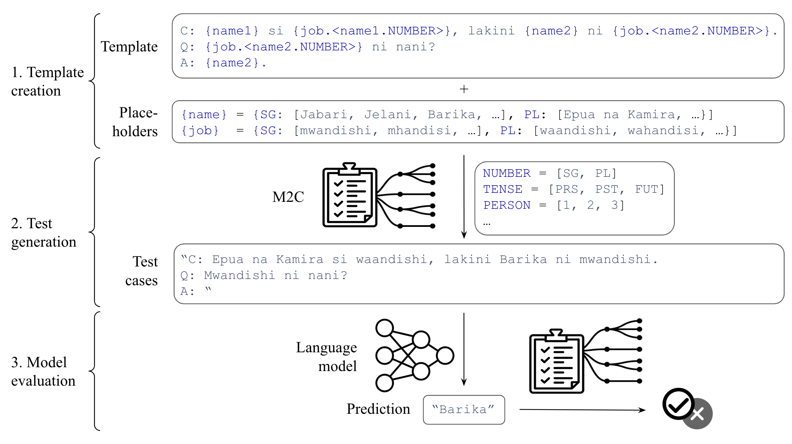

# Multilingual Morphological Checklist (M2C)

This repo contains code and data that enable the creation of targeted behavioral
tests in a diverse set of languages.

## What is behavioral testing?

Behavioral testing, also known as black-box testing, is a practice from software
testing that examines a system without knowing its internals. Specifically, we
test a system's capabilities solely based on how the system responds to specific
inputs.

In our setting, a test consists of a context and a question and we determine whether
a language model passes the test based on its answer.

## Framework

Our framework consists of three stages:



1. Template creation: A user creates a template and placeholders that test a capability in a specific language.
2. Test generation: Tests are generated based on the template and placeholders according to morphological rules.
3. Model evaluation: A model is evaluated on the generated tests.

### Template creation

A user provides a template as a string, a list of values for each place-holder, and an optional configuration dictionary in case of duplicate placeholders.
The placeholder values can either be passed without inflections (for example, names in English) as a list of strings, or as a list of dictionaries with dimension attributes as keys and corresponding inflections as values.

### Test generation

Tests are generated for each template by substituting values for each placeholder based on their morphological attributes.

### Model evaluation

Models are fed each test as input and produce an output. The output is compared to the gold answers for each test using string matching and regex.

## Reference

If you use the code or data in this repo, please cite our paper as:

```
@inproceedings{hlavnova-ruder-2023-empowering,
    title = "Empowering Cross-lingual Behavioral Testing of NLP Models with Typological Features",
    author = "Hlavnova, Ester  and
      Ruder, Sebastian",
    booktitle = "Proceedings of the 61st Annual Meeting of the Association for Computational Linguistics (Volume 1: Long Papers)",
    month = July,
    year = "2023",
    address = "Toronto, Canada",
    publisher = "Association for Computational Linguistics",
}
```
